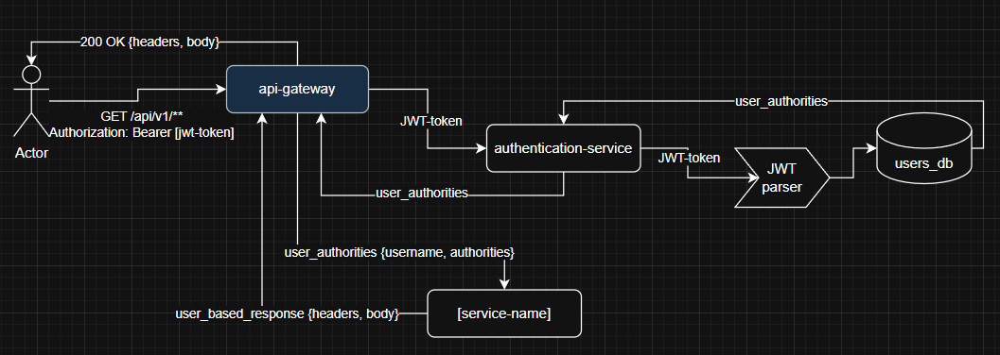
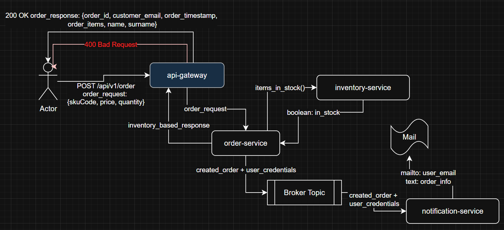
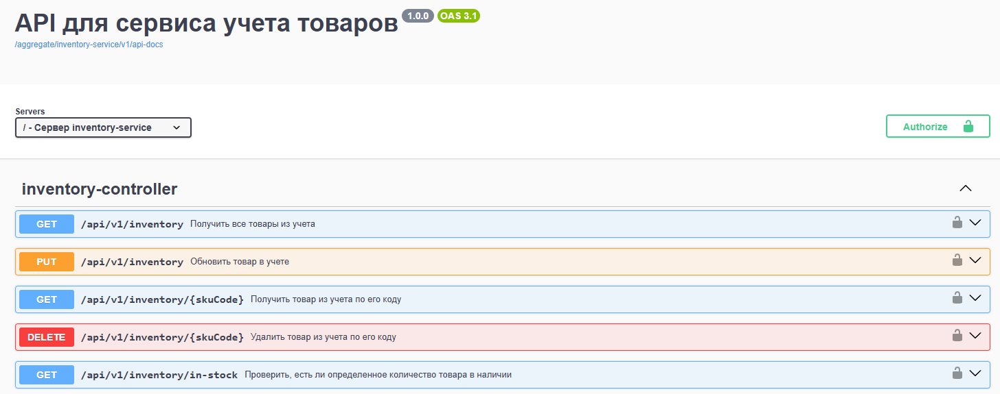
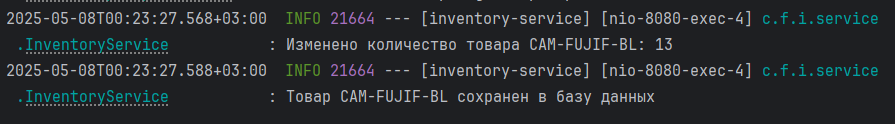

# Магазин фототехники
Данный проект представляет собой полнофункциональный интернет-магазин,
разработанный для демонстрации современных подходов к созданию,
развертыванию и тестированию веб-приложений

## Цели проекта
- **Разработка архитектуры веб-приложения:** 
проектирование клиент-серверной части (Frontend + Backend), выбор стека технологий (например, React + Node.js + PostgreSQL)

- **Реализация ключевых функций интернет-магазина:** 
каталог товаров, корзина, авторизация

- **Тестирование компонентов и системы:**
написание unit- и integration-тестов, проверка UI/UX, нагрузочное тестирование.

- **Внедрение CI/CD и DevOps-практик:**
настройка пайплайна, автоматизация сборки, деплоя и тестирования.

- **Анализ результатов и доработка:**
исправление багов, оптимизация производительности

## Функционал приложения
### Клиентская часть
#### Товары
- Просмотр товаров
- Каталог товаров с фильтрами
- Группировка по категориям (фотоаппараты, объективы, аксессуары, освещение).
- Работа с корзиной
- Добавление/удаление товаров.
- Изменение количества товаров.
- Отображение итоговой суммы.

#### Заказы
- Оформление заказа
- Формирование заказа из товаров в корзине.
- Обязательная авторизация (если пользователь не вошел в систему — перенаправление на страницу входа/регистрации)
- Авторизация и регистрация
- Вход по логину/паролю

#### Уведомления
- Подтверждение заказа

### Административная часть
#### Товары
- Управление товарами
- Добавление/редактирование/удаление товаров
- Загрузка и обновление изображений
- Управление категориями и характеристиками

#### Склад
- Учет товаров
- Отслеживание остатков на складе

#### Заказы
- Управление заказами
- Просмотр списка заказов
- Фильтрация заказов по дате, статусу, клиенту
- Управление пользователями
- Просмотр зарегистрированных пользователей

## Архитектура системы


### Описание микросервисов
```markdown
Замечание: Все приведенные ниже эндпоинты имеют префикс `/api/[version]`
Для удобства эти префиксы были опущены
Например, `/api/v1/auth/register` будет выведен как `/auth/register`
```

_Курсивом_ выделено описание эндпоинтов, доступ к которым есть только у администраторов

#### API-шлюз
Предназначен для распределения нагрузки между репликациями сервисов, а также для удобства администрирования и мониторинга сервисами

#### Сервис аутентификации (authentication-service)
В приложении используется аутентификация на основе JWT (Json Web Token)

**Данный сервис предназначен для:**
- Генерации токенов
- Валидации уже сгенерированных токенов
- `Получение информации о пользователе по его токену/имени`

**Эндпоинты сервиса:**
- `POST /auth/register` - Зарегистрировать нового пользователя
- `POST /auth/login` - Аутентифицировать существующего пользователя
- `GET /auth/register` - Получить полномочия пользователя по его токену
- `POST /users/[username]` - _Получить информацию о пользователе по его имени_

**Схема аутентификации в сервисах через API-шлюз и `authentication-service`**



```
Данная схема позволяет обойти интеграцию JWT-парсера в каждый используемый сервис,
а передавать ему уже готовые данные о пользователе
```

#### Сервис учета товаров (inventory-service)

**Данный сервис предназначен для:**
- Просмотра, добавления / удаления наименований товаров
- Управления категориями и характеристиками
- Учета товаров на складе

**Эндпоинты сервиса:**

_Контроллер учета товаров_
- `GET /inventory` - _Получить все товары из учета_
- `GET /inventory/{skuCode}` - _Получить товар из учета по его коду_
- `GET /inventory/in-stock` - _Проверить наличие товара (по коду и количеству)_
- `PUT /inventory` - _Обновить товар в учете_
- `DELETE /inventory/{skuCode}` - _Удалить товар из учета по его коду_

_Контроллер наименований товаров_
- `GET /inventory/products` - Получить все товары (с фильтром по категории)
- `GET /inventory/products/{skuCode}` - Получить товар по его коду
- `GET /inventory/products/categories` - Получить все категории товаров
- `POST /inventory/products` - _Создать новый товар_
- `DELETE /inventory/products/{skuCode}` - _Удалить товар по его коду_

#### Сервис оформления заказов (order-service) + Сервис оповещений (notification-service)

##### Сервис оформления заказов

**Данный сервис предназначен для:**
- Формирования заказа из товаров в корзине
- Оформления заказов
- Управления заказами
- Просмотр списка заказов

**Эндпоинты сервиса:**
- `GET /order` - _Получить все заказы_
- `GET /order/user` - Получить мои заказы
- `GET /order/{id}` - _Получить заказ по его ID_
- `POST /order` - Оформить новый заказ

Примечания:
1. Для доступа к личным заказам (/order/user) требуется авторизация любого уровня
2. ID заказа передается в формате UUID

##### Сервис оповещений

**Данный сервис предназначен для:**
- Формирования и отправки писем о созданных заказах клиентам

**Схема оформления клиентского заказа и оповещения пользователей о нем**



#### Сервис изображений (image-service)

**Данный сервис предназначен для:**
- Просмотра изображений товаров / категорий по их идентификаторам
- Создания новых изображений товаров / категорий

**Эндпоинты сервиса:**
- `GET /images/products/[skuCode]` - Получить изображение товара по идентификатору товара
- `POST /images/products/[skuCode]` - _Добавить изображение товара_


- `GET /images/categories/[categoryCode]` - Получить изображение категории товара по идентификатору категории
- `POST /images/products/[skuCode]` - _Добавить изображение категории товара_

## Реализация архитектуры

### Технологический стек

- **Микросервисы**:  
  Все сервисы реализованы на `Spring Boot 3.4.2` с модульной структурой


- **Базы данных**:  
  `PostgreSQL 17.2` для всех сервисов с индивидуальными схемами


- **Межсервисное взаимодействие**:
    - Синхронное: `REST API: Java RestTemplate / RestClient`
    - Асинхронное: `Apache Kafka` (брокер сообщений)

    **Настройка подключения к брокеру Apache Kafka**
    ```yaml
    kafka:
      bootstrap-servers: localhost:9092
      consumer:
        group-id: notification-service
        key-deserializer: org.apache.kafka.common.serialization.StringDeserializer
        value-deserializer: io.confluent.kafka.serializers.KafkaAvroDeserializer
        properties:
          schema.registry.url: http://127.0.0.1:8085
          specific.avro.reader: true
    ```

- **Хранение файлов**:  
  Изображения товаров хранятся на файловой системе сервера `image-service`


- **Уведомления**:  
  Email-рассылка через `JavaMailSender` на почтовый сервер `Mailtrap`

  **Настройка подключения к почтовому серверу Mailtrap**
  ```yaml
  mail:
    host: sandbox.smtp.mailtrap.io
    port: 2525
    username: "*******"
    password: "*******"
  ```

### Ключевые особенности

**Конфигурация Spring Cloud для API-шлюза**
```yaml
spring:
  cloud:
    gateway:
      routes:
        - id: inventory-service-route
          uri: http://localhost:8080
          predicates:
            - Path=/api/v1/inventory/**
          filters:
            - name: RequestHeader
              args:
                name: Authorization
                value: Bearer {token}

        - id: order-service-route
          uri: http://localhost:8081
          predicates:
            - Path=/api/v1/order/**
          filters:
            - name: RequestHeader
              args:
                name: Authorization
                value: Bearer {token}

        - id: authentication-service-route
          uri: http://localhost:8083
          predicates:
            - Path=/api/v1/auth/**

        - id: image-service-route
          uri: http://localhost:8084
          predicates:
            - Path=/api/v1/images/**
```

**Контейнеризация компонентов через `Docker` и `Docker Compose`** (пример для `inventory-service`)
```yaml
services:
  inventory-service-db:
    container_name: inventory-service-db
    image: postgres:17.2
    environment:
      POSTGRES_USER: postgres
      POSTGRES_PASSWORD: secret
      PGDATA: /var/lib/postgresql/data
    volumes:
      - ./docker/inventory-service:/docker-entrypoint-initdb.d
      - inventory-service-db-data:/var/lib/postgresql/data
    ports:
      - "15432:5432"
    restart: unless-stopped
volumes:
  inventory-service-db-data:
```

## Тестирование

**Технологии тестирования:**
- `JUnit 5 `+ `Mockito` для unit-тестов
- `Spring Boot Test` + `Testcontainers` для интеграционных тестов
- `MockMvc` для тестирования контроллеров

### Unit-тестирование

**Тест OrderController:**

```java
@ExtendWith(MockitoExtension.class)
class OrderControllerTest {
  @Mock
  private OrderService orderService;
  
  @InjectMocks
  private OrderController orderController;
  
  @Test
  void createOrder_ShouldReturnCreatedOrder() {
    OrderRequest request = new OrderRequest(List.of("sku1", "sku2"));
    OrderResponse response = new OrderResponse(UUID.randomUUID(), "CREATED");
    
    when(orderService.createOrder(any(), eq("user1"))
            .thenReturn(response));
    OrderResponse result = orderController.createOrder(request, () -> "user1");
    
    assertNotNull(result);
    assertEquals("CREATED", result.status());
    verify(orderService).createOrder(request, "user1");
  }
}
```

### Интеграционное тестирование

**Тест ProductController:**

```java
@SpringBootTest
@AutoConfigureMockMvc
class ProductControllerIntegrationTest {
  @Autowired
  private MockMvc mockMvc;
  
  @MockBean
  private ProductService productService;
  
  @Test
  void getProductBySku_ShouldReturnProduct() throws Exception {
      ProductItem item = new ProductItem("sku123", "Camera", 999.99);
      when(productService.findItemBySkuCode("sku123")).thenReturn(item);

      mockMvc.perform(get("/api/v1/inventory/products/sku123"))
             .andExpect(status().isOk())
             .andExpect(jsonPath("$.skuCode").value("sku123"));
  }
}
```

## Установка и настройка

1. Установите Docker Desktop на свой ПК (для daemon-а) https://docs.docker.com/desktop/setup/install/windows-install/
2. Установите и запустите `git bash`
3. Клонируйте репозиторий в желаемую папку

```shell
git clone https://github.com/duahifnv/photo-store.git
cd photo-store
```

4. Проверьте, что `docker daemon` запущен

```shell
docker --version
```

5. Запустите docker-compose файл
```shell
docker compose -f docker-compose.yaml -f docker-compose.kafka.yaml up -d 
```

> [!NOTE]
> Доступ к API осуществляется по адресу `http://192.168.0.1:9000/api/v1`

> [!NOTE]
> Для исследования API воспользуйтесь SwaggerUI по адресу `http://192.168.0.1:9000/api/v1/swagger-ui`
> 
> 

## Мониторинг
### Логирование

Логирование сервисов производится при помощи библиотеки `Slf4j`

**Пример логирования изменения количество товара в `inventory-service`**



## Заключение

### Оценка успешности проекта

**Достигнутые результаты:**
- Реализована модульная микросервисная архитектура
- Обеспечено разделение ответственности между сервисами:
  - `auth-service` - аутентификация/авторизация
  - `inventory-service` - управление остатками
  - `order-service` - обработка заказов
  - `image-service` - работа с изображениями
- Настроено межсервисное взаимодействие через `REST` и `Kafka`
- Достигнуто `85%` покрытие кода тестами

**Ключевые метрики:**

| Показатель        | Значение |
|-------------------|----------|
| Время отклика API | < 300мс  |
| Успешных запросов | 98.7%    |
| Ошибок 5xx        | 0.3%     |
| Покрытие тестами  | 85%      |

### Возможные направления развития

**Технические улучшения:**
1. **Масштабируемость**:
  - Переход на `Kubernetes` для оркестрации
  - Внедрение `Redis` для кэширования

2. **Безопасность**:
  - Добавление `OAuth 2.0` провайдеров
  - Внедрение мониторинга подозрительных запросов

3. **Функциональность**:
  - Система возвратов и отмены заказов
  - Личный кабинет с историей просмотров
  - AI-рекомендации товаров

**Бизнес-развитие:**
- Интеграция с маркетплейсами (Wildberries, Ozon)
- Партнерская программа для фотографов
- Аренда фототехники как дополнительный сервис

**Оптимизации:**
- Миграция хранения изображений в S3-совместимое хранилище
- Введение `GraphQL` для сложных запросов
- Реализация Event Sourcing для критичных операций
